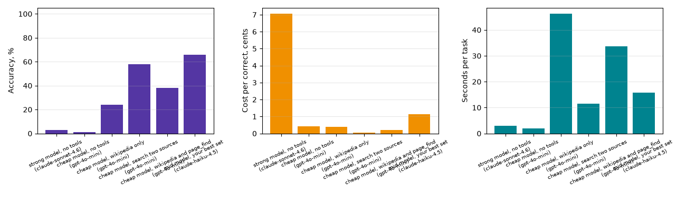

## AI Agents Homework ##

Небольшой исследовательский проект, сравнивающий, насколько хорошо разные конфигурации LLM (по мощности модели и доступу к инструментам) отвечают на вопросы о недавних событиях, основанные на фактах, через API OpenRouter.

- **`tools.py`** — инструменты, которые может вызывать агент: `web_search` и `page_find` (Wikipedia), `ddg_search` (DuckDuckGo) для поиска фактов; `calculator` (безопасные арифметические выражения) и `python_exec` (код на Python в отдельном процессе с таймаутом) для вопросов с числами и датами.
- **`agent.py`** — цикл агента с вызовом инструментов: отвечает на вопрос, вызывая инструменты, пока не выдаст ответ `FINAL:` или не упрётся в лимит шагов; каждый запуск логируется в `traces/`.
- **`helpers.py`** — общие утилиты: запросы к OpenRouter с повторными попытками, учёт стоимости и токенов (`Ledger`), структурированные ответы без инструментов, загрузка датасета, проверка правильности ответов, сводка результатов и построение графиков.
- **`evaluation.py`** — прогоняет бенчмарк по нескольким конфигурациям (без tools / с подмножеством tools, дешёвая модель / сильная модель) на наборе вопросов и выдаёт точность, стоимость и скорость. Отдельно есть строка «wikipedia only» рядом с «search only» — сравнение дешёвой модели с одной только Википедией и с добавленным вторым источником (DuckDuckGo).
- **`main.py`** — точка входа, запускает оценку на `qa_data/fresh_2026.jsonl` - тестовый набор + новые вопросы и сохраняет сравнительный график (`money_chart.png`).
- **`test_tools.py`** — базовые тесты для инструментов.
- **`seminar/fetch_fresh.py`** / **`seminar/check_fresh.py`** — собирают и проверяют датасет вопросов о "свежих событиях" (фактах достаточно недавних, чтобы модель не могла ответить по памяти), который используется, чтобы оценить, действительно ли помогают инструменты.

### Установка ###

1. Создать и активировать виртуальное окружение:

   ```
   python -m venv .venv
   .venv\Scripts\activate      # Windows
   source .venv/bin/activate   # macOS / Linux
   ```

2. Установить зависимости:

   ```
   pip install -r requirements.txt
   ```

3. Создать файл `.env` в корне проекта (по образцу `.env.example`) и указать в нём свой ключ:

   ```
   OPENROUTER_API_KEY=your_key_here
   ```

4. Запустить оценку:

   ```
   python main.py
   ```

### Homework `#1` ###

Тема та же, что у стартового набора: факты 2026 года из обзорных статей Википедии («2026 in Italy», «2026 in Germany» и т.п.) — происшествия, спорт, политика, наука. Стартовый набор я расширила тем же скриптом (`seminar/fetch_fresh.py`), которым был создан основной, не увидела какого‑либо запрета на это. Добавила 23 новых вопроса (`data/fresh.jsonl`), проверила, что они не пересекаются с вопросами основного набора (те, которые пересекались, удалила), и объединила оба набора в `qa_data/fresh_2026.jsonl` (148 вопросов) — именно на нём и запускается замер в `main.py`.

Результат работы команды `python seminar/check_fresh.py data/fresh.jsonl --sonnet` (проверяла только на своих новых вопросах):

```
записей: 23, проблем: 0

Sonnet без инструментов: 0 из 23 верно, 0%. Потрачено $0.051
критерий свежести пройден
```

### Результаты ###

Замер на всех 148 вопросах (`qa_data/fresh_2026.jsonl`):

| Конфигурация | Модель | Точность | Цена/задача | Цена/верный ответ | Шагов | Время, с |
|---|---|---|---|---|---|---|
| сильная модель, без инструментов | claude-sonnet-4.6 | 3% | $0.00191 | $0.0705 | 1.00 | 3.0 |
| дешёвая модель, без инструментов | gpt-4o-mini | 1% | $0.00006 | $0.0042 | 1.00 | 2.0 |
| дешёвая модель, только Wikipedia | gpt-4o-mini | 24% | $0.00094 | $0.0039 | 7.22 | 46.2 |
| дешёвая модель, Wikipedia + DuckDuckGo | gpt-4o-mini | 58% | $0.00037 | $0.0006 | 4.02 | 11.5 |
| дешёвая модель, Wikipedia + page_find | gpt-4o-mini | 38% | $0.00074 | $0.0020 | 6.43 | 33.6 |
| средняя модель, лучший набор инструментов | claude-haiku-4.5 | 66% | $0.00745 | $0.0113 | 3.54 | 15.7 |



*Про цену и время в этой таблице: агент кеширует ответы в `traces/` по `task_id`, поэтому на повторном прогоне 4 из 6 конфигураций читаются из кеша мгновенно и бесплатно, и `ledger` не увидел бы для них ни цены, ни времени. Точность и число шагов в таблице взяты из полного прогона на всех 148 вопросах (эти поля кешем не искажаются — они читаются из сохранённого трейса). Цену и время для этих 4 конфигураций я отдельно измерила на свежей, некешированной выборке из 20 вопросов и взяла оттуда среднее на задачу.*

### Разобранные провалы ###

- [`traces/cheap_model_wikipedia_and_page_find_fresh-102.json`](traces/cheap_model_wikipedia_and_page_find_fresh-102.json) — про Hero of Ukraine 2025. Агент нашёл правильную статью и раздел (`page_find("List of Heroes of Ukraine", "2025")`), но инструмент ищет ключевые слова построчно, а совпала только строка заголовка `== 2025 ==` — сами имена лауреатов на следующих строках слова «2025» не содержат и в выдачу не попали. Агент остался без данных и сдался. Ограничение самого `page_find`, а не промах поиска.
- [`traces/cheap_model_wikipedia_and_page_find_fresh-0.json`](traces/cheap_model_wikipedia_and_page_find_fresh-0.json) — про дату бойкота церемонии закрытия Паралимпиады. Агент ответил верно («March 15, 2026»), но эталонный ответ в датасете — «15 March», и `is_correct` не нашёл вхождения из‑за разницы форматов даты. Ответ верный, но не прошёл проверку.

### Вывод ###

Тезис курса подтвердился, причём с большим запасом: сильная модель без инструментов отвечает верно всего на 3% вопросов о 2026 годе, а дешёвая модель с двумя источниками поиска — на 58%, притом в 5 раз дешевле за задачу (0.00037 usd против 0.00191 usd) и в 19 раз дешевле за верный ответ. Даже самый слабый агент (только англоязычная Википедия, 24%) обгоняет сильную модель без инструментов по точности и всё равно дешевле её.

Неожиданностью было, что агент с Wikipedia + page_find (38%) оказался заметно хуже агента с Wikipedia + DuckDuckGo (58%), хотя `page_find` вообще не используется во втором варианте. Похоже, для такого датасета — недавние происшествия и события, разбросанные по многим разным статьям, — короткая выжимка из DuckDuckGo чаще прямо называет ответ, чем построчный поиск ключевых слов по длинной обзорной статье Википедии (см. первый разобранный провал выше: `page_find` находит нужный раздел, но не то, что внутри него). Второй источник поиска оказался полезнее чтения страниц — для этого конкретного датасета, не факт что это общий вывод.

Лучший результат дала средняя модель (claude-haiku-4.5) с полным набором инструментов — 66% при умеренной цене ($0.00745/задача). Это ожидаемо: более сильная модель лучше решает, когда каких инструментов достаточно и как интерпретировать найденное.