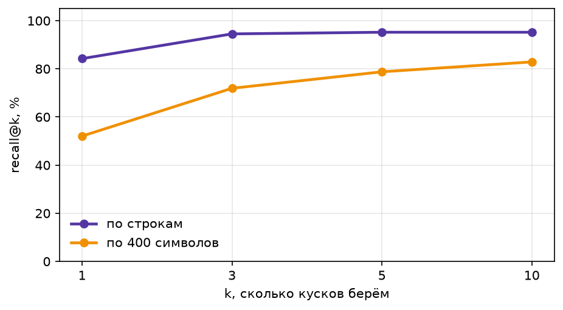
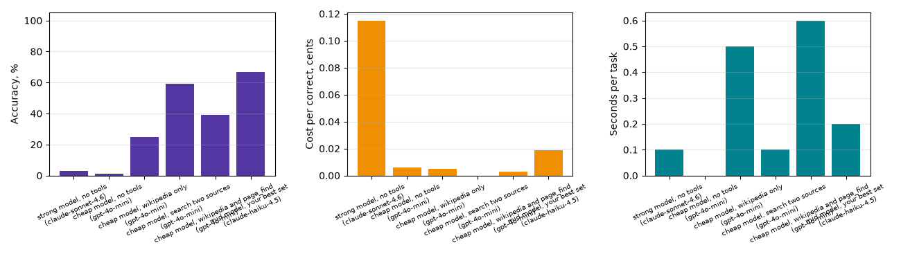

## AI Agents Homework ##

Небольшой исследовательский проект, сравнивающий, насколько хорошо разные конфигурации LLM (по мощности модели и доступу к инструментам) отвечают на вопросы о недавних событиях, основанные на фактах, через API OpenRouter.

- **`tools.py`** — инструменты, которые может вызывать агент: `web_search` и `page_find` (Wikipedia), `ddg_search` (DuckDuckGo) для поиска фактов; `calculator` (безопасные арифметические выражения) и `python_exec` (код на Python в отдельном процессе с таймаутом) для вопросов с числами и датами.
- **`agent.py`** — цикл агента с вызовом инструментов: отвечает на вопрос, вызывая инструменты, пока не выдаст ответ `FINAL:` или не упрётся в лимит шагов; каждый запуск логируется в `traces/`.
- **`helpers.py`** — общие утилиты: запросы к OpenRouter с повторными попытками, учёт стоимости и токенов (`Ledger`), структурированные ответы без инструментов, загрузка датасета, проверка правильности ответов, сводка результатов и построение графиков.
- **`evaluation.py`** — прогоняет бенчмарк по нескольким конфигурациям (без tools / с подмножеством tools, дешёвая модель / сильная модель) на наборе вопросов и выдаёт точность, стоимость и скорость. Отдельно есть строка «wikipedia only» рядом с «search only» — сравнение дешёвой модели с одной только Википедией и с добавленным вторым источником (DuckDuckGo).
- **`main.py`** — точка входа, запускает оценку на `qa_data/fresh_2026.jsonl` - тестовый набор + новые вопросы и сохраняет сравнительный график (`money_chart.png`).
- **`test_tools.py`** — базовые тесты для инструментов.
- **`seminar/fetch_fresh.py`** / **`seminar/check_fresh.py`** — собирают и проверяют датасет вопросов о "свежих событиях" (фактах достаточно недавних, чтобы модель не могла ответить по памяти), который используется, чтобы оценить, действительно ли помогают инструменты.

### Установка ###

1. Создать и активировать виртуальное окружение:

   ```
   python -m venv .venv
   .venv\Scripts\activate      # Windows
   source .venv/bin/activate   # macOS / Linux
   ```

2. Установить зависимости:

   ```
   pip install -r requirements.txt
   ```

3. Создать файл `.env` в корне проекта (по образцу `.env.example`) и указать в нём свой ключ:

   ```
   OPENROUTER_API_KEY=your_key_here
   ```

4. Запустить оценку:

   ```
   python main.py
   ```

## Homework `#2` ##

Ноутбук — [`homework02.ipynb`](homework02.ipynb), код адаптирован из `seminar02_skeleton_full.ipynb` под свой корпус.

### Шаг 1. Корпус и вопросы ###

Корпус - 30 обзорных страниц Wikipedia про 2026 год (`data/corpus_2026.jsonl`, 891 391 символ), те же темы, что использовались в первой домашке, полные тексты скачаны заново скриптом `fetch_corpus.py`. Вопросы - 146 из 148 вопросов первой домашки (`data/fresh_2026.jsonl`), у каждого есть поле `evidence` - цитата из корпуса, по которой размечается верный кусок; 2 вопроса отсеялись, видимо потому, что в сами статьи были внесены правки в формулировку конкретных событий. Отдельно 10 вопросов без ответа (`data/unanswerable.jsonl`) на ту же тему, для каждого в файле указано, какие страницы проверялись и что нужная фраза нигде в корпусе не встретилась (grep по всему тексту).

### Шаг 2. Индекс в Milvus и качество поиска ###

Две нарезки: наивная - по 400 символов без оглядки на границы и осмысленная - по строкам. Граница осмысленного куска проходит на переносе строки, потому что каждая обзорная страница устроена как список датированных событий, где одна строка, это одно законченное событие, а заголовок-месяц едет с ней как метаданные `section`. После нарезки - 6060 кусков по строкам и 2234 по 400 символам (порог задания в 300 кусков пройден с запасом).

Эмбеддинги (`openai/text-embedding-3-small`, 512 измерений) считаются один раз и кешируются на диск в `emb_cache.npz` (8.2 МБ, закоммичен) по sha1 текста - повторный прогон ноутбука ничего не пересчитывает. Обе нарезки проиндексированы в Milvus отдельными коллекциями (`lines`, `chars`) с метаданными `page`/`section`/`url`/`text` рядом с вектором. Демонстрация фильтра - поиск про землетрясения по коллекции `lines` с фильтром `page == "2026 in Japan"`, сужающим общую выдачу до одной страницы.

recall@k (по выдаче Milvus, k = 1, 3, 5, 10):

| k | по строкам | по 400 символов |
|---|---|---|
| 1 | 0.842 | 0.521 |
| 3 | 0.945 | 0.719 |
| 5 | 0.952 | 0.788 |
| 10 | 0.952 | 0.829 |



Recall@5 у нарезки по строкам (0.952) равен recall@10 (0.952) - рост k с 5 до 10 ничего не даёт, а нарезка по символам заметно хуже на любом k. Для шага 3 берём k=5 на нарезке по строкам: качество уже на плато, а контекст короче и дешевле, чем при k=10.

Гибрид (вектор / слова по IDF / RRF-слияние рангов), recall@1 и recall@5:

| нарезка | поиск | recall@1 | recall@5 |
|---|---|---|---|
| по 400 символов | только вектор | 0.52 | 0.79 |
| по 400 символов | только слова | 0.76 | 0.90 |
| по 400 символов | гибрид RRF | 0.70 | 0.90 |
| по строкам | только вектор | 0.86 | 0.98 |
| по строкам | только слова | 0.89 | 0.98 |
| по строкам | гибрид RRF | 0.88 | 1.00 |

Здесь гибрид не всегда выигрывает по recall@1 у одних лишь слов (0.70 против 0.76 на символьной нарезке, 0.88 против 0.89 на строчной) - вопросы в датасете короткие и обычно содержат редкое собственное имя или число, по которому точный поиск по словам уже почти не ошибается, а RRF слегка размывает верхушку списка вкладом вектора. Зато по recall@5 гибрид не хуже лучшего из двух источников, а на строчной нарезке даже выходит на 1.00 — там, где по отдельности ни вектор, ни слова полного покрытия не дают.

Потрачено на шаге 2: $0.0086 (эмбеддинги 6060 + 2234 + 146 + 10 текстов), в бюджет 30–50 центов на весь замер укладываемся с запасом.


### Homework `#1` ###

Тема та же, что у стартового набора: факты 2026 года из обзорных статей Википедии («2026 in Italy», «2026 in Germany» и т.п.) — происшествия, спорт, политика, наука. Стартовый набор я расширила тем же скриптом (`seminar/fetch_fresh.py`), которым был создан основной, не увидела какого‑либо запрета на это. Добавила 23 новых вопроса (`data/fresh.jsonl`), проверила, что они не пересекаются с вопросами основного набора (те, которые пересекались, удалила), и объединила оба набора в `qa_data/fresh_2026.jsonl` (148 вопросов) — именно на нём и запускается замер в `main.py`.

#### Правки после ревью ####

Большая часть уже была исправлена на момент получения обратной связи. Я исправила только пункт `Часть своих вопросов нарушает требования. fresh-14 про выбор Милана и Кортины столицами Олимпиады с ответом «24 June 2019», это событие до 2025 года, а fresh-6 про прогноз температуры, то есть про ожидаемое, а не случившееся` - заменила оба вопроса на проверенные события 2026 года из `data/corpus_2026.jsonl`: про атаку на футбольном матче в Саламанке (Мексика) и про лыжника Лукаса Пиньейру Браатена, первого спортсмена от Бразилии с медалью Олимпиады. `seminar/check_fresh.py data/fresh.jsonl --sonnet` перепрогнан, результат ниже. Исправила оба вопроса и в `qa_data/fresh_2026.jsonl`, удалила устаревшие кешированные трейсы для этих двух id и пересчитала их агентом заново.

Результат работы команды `python seminar/check_fresh.py data/fresh.jsonl --sonnet` после замены двух вопросов:

```
записей: 23, проблем: 0

Sonnet без инструментов: 0 из 23 верно, 0%. Потрачено $0.052
критерий свежести пройден
```

### Результаты ###

Замер на всех 148 вопросах (`qa_data/fresh_2026.jsonl`), свежий прогон `python main.py` после правок:

| Конфигурация | Модель | Точность | Цена/задача | Цена/верный ответ | Шагов | Время, с |
|---|---|---|---|---|---|---|
| сильная модель, без инструментов | claude-sonnet-4.6 | 3% | $0.00191 | $0.0705 | 1.00 | 3.0 |
| дешёвая модель, без инструментов | gpt-4o-mini | 1% | $0.00006 | $0.0042 | 1.00 | 2.0 |
| дешёвая модель, только Wikipedia | gpt-4o-mini | 25% | $0.00094 | $0.0039 | 7.20 | 46.2 |
| дешёвая модель, Wikipedia + DuckDuckGo | gpt-4o-mini | 59% | $0.00037 | $0.0006 | 3.97 | 11.5 |
| дешёвая модель, Wikipedia + page_find | gpt-4o-mini | 39% | $0.00074 | $0.0020 | 6.45 | 33.6 |
| средняя модель, лучший набор инструментов | claude-haiku-4.5 | 67% | $0.00745 | $0.0113 | 3.51 | 15.7 |



*Про цену и время в этой таблице: агент кеширует ответы в `traces/` по `task_id`, поэтому на повторном прогоне 4 из 6 конфигураций читаются из кеша мгновенно и бесплатно, и `ledger` не увидел бы для них ни цены, ни времени. Точность и число шагов в таблице взяты из полного прогона на всех 148 вопросах (эти поля кешем не искажаются — они читаются из сохранённого трейса, включая два заново пересчитанных после замены вопросов). Цену и время для этих 4 конфигураций я отдельно измерила на свежей, некешированной выборке из 20 вопросов и взяла оттуда среднее на задачу.*

### Разобранные провалы ###

- [`traces/cheap_model_wikipedia_and_page_find_fresh-102.json`](traces/cheap_model_wikipedia_and_page_find_fresh-102.json) — про Hero of Ukraine 2025. Агент нашёл правильную статью и раздел (`page_find("List of Heroes of Ukraine", "2025")`), но инструмент ищет ключевые слова построчно, а совпала только строка заголовка `== 2025 ==` — сами имена лауреатов на следующих строках слова «2025» не содержат и в выдачу не попали. Агент остался без данных и сдался. Ограничение самого `page_find`, а не промах поиска.
- [`traces/cheap_model_wikipedia_and_page_find_fresh-0.json`](traces/cheap_model_wikipedia_and_page_find_fresh-0.json) — про дату бойкота церемонии закрытия Паралимпиады. Агент ответил верно («March 15, 2026»), но эталонный ответ в датасете — «15 March», и `is_correct` не нашёл вхождения из‑за разницы форматов даты. Ответ верный, но не прошёл проверку.

### Вывод ###

Тезис курса подтвердился, причём с большим запасом: сильная модель без инструментов отвечает верно всего на 3% вопросов о 2026 годе, а дешёвая модель с двумя источниками поиска — на 59%, притом в 5 раз дешевле за задачу (0.00037 usd против 0.00191 usd) и в 19 раз дешевле за верный ответ. Даже самый слабый агент (только англоязычная Википедия, 25%) обгоняет сильную модель без инструментов по точности и всё равно дешевле её.

Неожиданностью было, что агент с Wikipedia + page_find (39%) оказался заметно хуже агента с Wikipedia + DuckDuckGo (59%), хотя `page_find` вообще не используется во втором варианте. Похоже, для такого датасета — недавние происшествия и события, разбросанные по многим разным статьям, — короткая выжимка из DuckDuckGo чаще прямо называет ответ, чем построчный поиск ключевых слов по длинной обзорной статье Википедии (см. первый разобранный провал выше: `page_find` находит нужный раздел, но не то, что внутри него). Второй источник поиска оказался полезнее чтения страниц — для этого конкретного датасета, не факт что это общий вывод.

Лучший результат дала средняя модель (claude-haiku-4.5) с полным набором инструментов — 67% при умеренной цене ($0.00745/задача). Это ожидаемо: более сильная модель лучше решает, когда каких инструментов достаточно и как интерпретировать найденное.